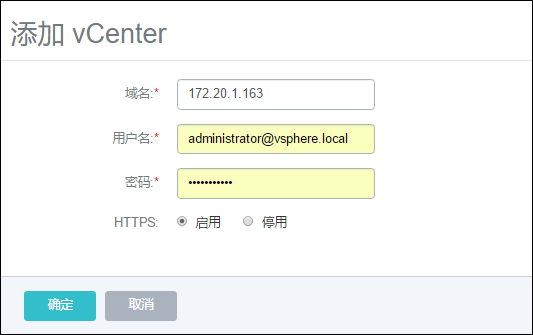

# 10 vCenter操作

1.添加vCenter

点击集群界面的添加vCenter按钮，进入添加vCenter界面。如图10-1-2所示。

* 目前只允许添加一个vCenter

###### 图10-1-1 集群界面（未添加vCenter）

###### 图10-1-2 添加vCenter界面

添加vCenter成功后，会自动添加vSphere的集群、物理机、镜像、网络、存储、云主机等资源，在每个资源的界面上都会自动显示。

**注意：**目前只支持对ESX(i)云主机的管理[10.2](/vCenter/ESX-vm.md)，其他资源的功能我们会在后续的版本中开放。

2.删除vCenter

当用户添加成功一个vCenter后，集群界面中“添加vCenter”按钮变为“删除vCenter”按钮。如图10-1-3所示。**删除vCenter后会清除其上所有资源在Mevoco中的记录，并不会删除vCenter上的真实资源。**（VMware vSphere Client上登录依然可以看到完整的已部署的VMware环境）

* 注意：勾选任意集群，出现红色的集群删除按钮，该按钮只对KVM集群生效。

###### 图10-1-3 集群界面（已添加vCenter）

点击“删除vCenter”按钮，弹出确认提示框，点击确定会删除vCener。

###### 图10-1-4 删除vCenter界面
